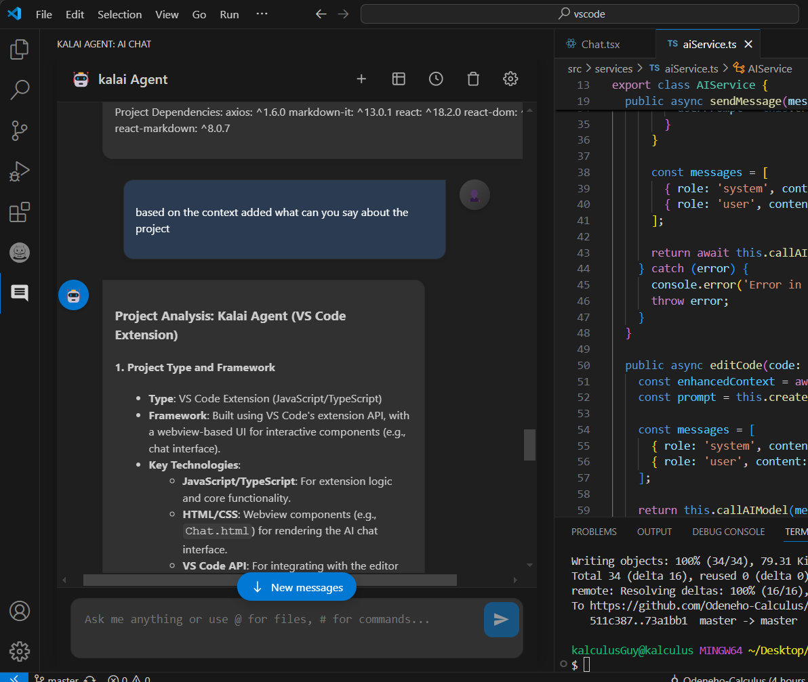

# Kalai Agent - AI-Powered Coding Assistant

Kalai Agent is an advanced AI-powered coding assistant that provides comprehensive project analysis, intelligent code suggestions, multi-step planning, and automated development tools for Visual Studio Code.

## Features

### 🤖 Intelligent Code Understanding
- **Context-Aware Suggestions**: Analyzes your entire codebase for accurate suggestions
- **Multi-Language Support**: Works with JavaScript, TypeScript, Python, Java, and more
- **Framework Detection**: Automatically detects and understands popular frameworks

<!--  -->

### 💡 Advanced Development Tools
- **Code Explanation**: Get detailed explanations of complex code segments
- **Test Generation**: Automatically generate comprehensive unit tests
- **Performance Optimization**: Identify and fix performance bottlenecks
- **Security Analysis**: Find and fix security vulnerabilities
- **Code Refactoring**: Intelligent code restructuring suggestions
- **Documentation Generation**: Auto-generate API docs and comments

### 🔄 Interactive Features
- **Chat Interface**: Natural conversation with the AI assistant

- **Code Context**: View and share code context with the AI
- **Command Palette Integration**: Quick access to all features
- **Selection-Based Assistance**: Get help with selected code segments

### 🛠 Project Analysis & Insights
- **Architecture Analysis**: Comprehensive project structure analysis
- **Dependency Management**: Track and analyze project dependencies
- **Code Quality Metrics**: Complexity analysis and quality scoring
- **File Search & Navigation**: Advanced codebase search capabilities
- **Multi-Step Task Planning**: Breaks down complex tasks into manageable steps
- **Real-Time Tech Info**: Get up-to-date information about frameworks and libraries

<!--  -->

## Getting Started

1. Install the extension from VS Code Marketplace
2. Open any code file in VS Code
3. Access the Kalai Agent through:
   - Activity Bar Icon
   - Command Palette (`Ctrl+Shift+P` / `Cmd+Shift+P`)
   - Context Menu (right-click)

## Usage Examples

### Chat Interface
- Click the Kalai icon in the Activity Bar
- Type your question or request
- Use `@` to reference files
- Use `#` for special commands

### Code Editing
1. Select code in editor
2. Right-click and choose "KalAI: Edit with AI"
3. Describe your desired changes
4. Review and apply suggestions

## Commands

### Code Analysis Commands
- `Kalai: Explain Code` - Get detailed explanations of selected code
- `Kalai: Generate Tests` - Create comprehensive unit tests
- `Kalai: Optimize Performance` - Find and fix performance issues
- `Kalai: Find Security Issues` - Security vulnerability analysis
- `Kalai: Refactor Code` - Intelligent code restructuring
- `Kalai: Generate Documentation` - Auto-generate docs and comments

### Project Commands
- `Kalai: Analyze Project Architecture` - Comprehensive project analysis
- `Kalai: Search Codebase` - Advanced search with AI insights

### Information Commands
- `Kalai: Get Latest Tech Info` - Current tech trends and updates
- `Kalai: Start Chat` - Open the AI chat interface
- `Kalai: Edit with AI` - Get AI assistance for selected code

## Extension Settings

The extension can be customized through VS Code's settings interface.

## Requirements

- Visual Studio Code ^1.99.1
- Active internet connection for AI features

## Privacy & Security

- All code analysis is performed locally
- No code or sensitive data is stored externally
- Secure communication with AI services

## Contributing

We welcome contributions! Please see our [Contributing Guide](CONTRIBUTING.md) for details.

## Release Notes

### 2.0.0 - Advanced AI Assistant
- ✨ Multi-step task planning and execution
- 🔍 Advanced project analysis and insights
- 🛡️ Security vulnerability detection
- 📚 Automatic documentation generation
- 🎯 Intelligent code refactoring
- 🌐 Real-time tech information
- 📊 Code quality metrics and analysis
- 🔧 Performance optimization tools

### 1.0.5 - Enhanced Chat
- Improved context awareness
- Better code analysis
- Bug fixes and performance improvements

### 1.0.0 - Initial Release
- Basic AI chat functionality
- Code analysis and suggestions
- Multi-language support

## Support

Found a bug or have a suggestion? Please open an issue on our [GitHub repository](https://github.com/Odeneho-Calculus/kalai-agent/issues).

## License

This project is licensed under the MIT License - see the [LICENSE](LICENSE) file for details.